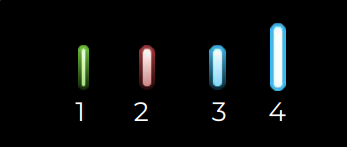
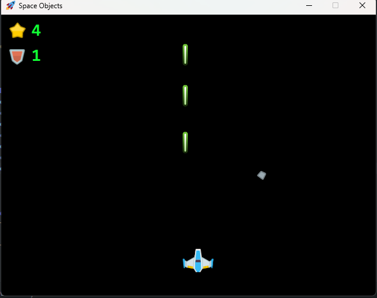
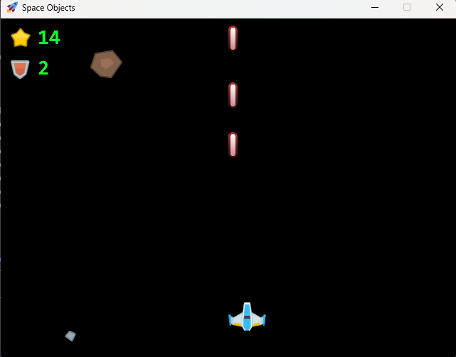

# 🚀 Projeto Space - JavaFX

Este projeto é um pequeno jogo 2D desenvolvido em Java utilizando JavaFX, no qual controlamos uma nave que deve destruir meteoros atirando lasers.

---

## 🎮 Funcionalidades

- Controle de movimentação da nave (esquerda e direita).
- Disparo de tiros usando a tecla `Espaço`.
- Tiros que sobem e colidem com meteoros.
- Meteoros de diferentes tamanhos e poderes, caindo do topo da tela.
- Sistema de pontuação: cada meteoro destruído vale 1 ponto.
- Sistema de evolução de nível: a cada 10 pontos, o nível do jogo aumenta até o nível máximo 4.

---

## 📷 Imagens do Projeto

### 🛡️ Pontos e níveis possíveis:

---

### 🔥 Jogo com Poder 1 (Laser básico):

---

### ⚡ Jogo com Poder 2 (Laser avançado):

---

## 🛠️ Tecnologias utilizadas

- **Java 17**
- **JavaFX SDK 21**

---

## 🚀 Como executar o projeto

1. Baixe o projeto no seu computador.
2. Configure o JavaFX no seu ambiente de desenvolvimento (VS Code ou IntelliJ).
3. Rode a classe principal `App.java` (pacote `br.com.joaocarloslima`).
4. Controle a nave:
   - `←` Mover para esquerda
   - `→` Mover para direita
   - `Espaço` Atirar lasers

---

## 🤝 Agradecimento

Este projeto foi desenvolvido como parte de um desafio proposto em sala de aula pelo professor **João Carlos Lima** ([joaocarloslima](https://github.com/joaocarloslima)).

Agradecemos pela orientação, paciência e incentivo ao aprendizado de programação orientada a objetos e desenvolvimento de interfaces gráficas!

---
